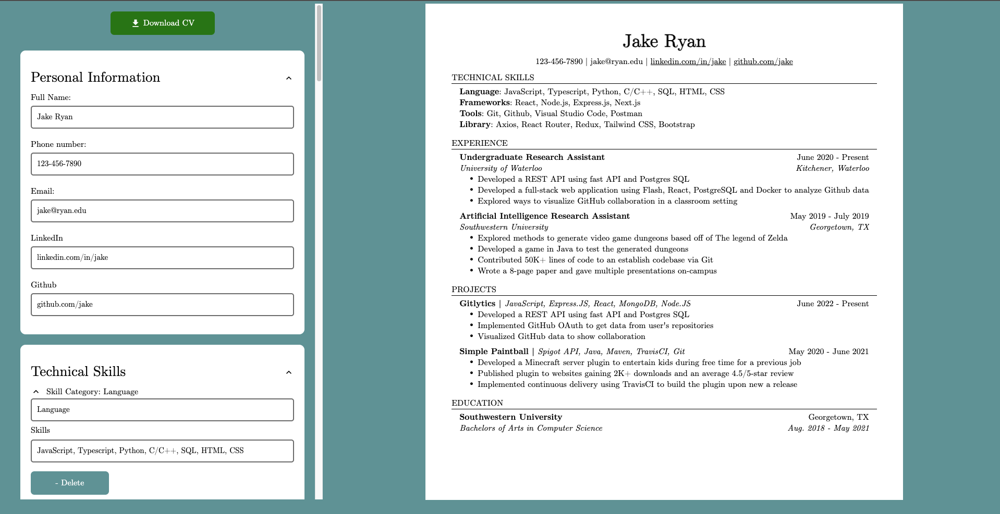

# CV-generator
## **Description**
EasyQuickCV is a modern and customizable resume Generator built with React. This app allows users to dynamically fill out their personal, education, and work details, preview a professional resume in real-time, and download it as a PDF.
## Live site screenshot

## **Installation**
> A live deployment of this [`EasyQuickCV`](https://easyquickcv.netlify.app) project is available on Netlify.

However, if you want to run the application and/or edit it's source code locally, feel free to:

1. Clone the repository with `git clone https://kermit60.github.io/cv-application` or download it as a [.zip](https://kermit60.github.io/cv-application/archive/refs/heads.main.zip) file and extract it.

2. Navigate to where the repository is saved on your local machine and follow the commands in the terminal:

```
cd cv-application
npm install
npm run dev
```
3. Open `localhost:5173` in any of your browsers

## **Features**
* Live preview of resume while editing.
* Editable sections: Personal Details, Education, Experience, and Projects.
* Download resume as a professionally formatted PDF.
* Example resume loaded by default
* Clean and user-friendly interface.
* Fixed sidebar with button adding and deletion features for each section

## **What I learned**
* Creating React components, using `data.jsx` for default data. Using props and functions as props
* Learned how to use hooks `useState` and how to transfer data between parent components
* How to export a component as a pdf for printing or saving using `window.print()` function
* How multiple CSS files interact with components and their children

## **Plan for Future Improvements**
* Converting to docx or other formats
* Drag and drop reordering functionality for resume sections for better customizability
* Save data locally or on the cloud
* Dark mode
* Better mobile responsiveness

## License
This project is under MIT licensing
